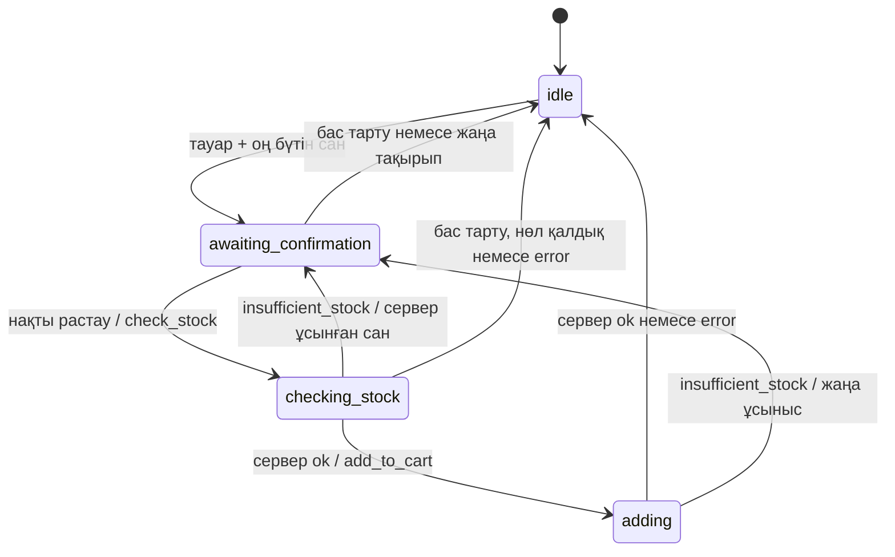

# ekt.kz — ЖИ сатушы-кеңесші қабаты

Бұл репозиторий команданың **3-адамының ғана** жұмысын қамтиды: NLU, диалог контексі, жауап құрастыру, аналог таңдау және себетке қосуды растау логикасы. Фронтенд, HTTP сервер, ekt.kz API, BasicAuth, себет базасы және деректерді сақтау іске асырылмайды.

## Іске қосу

Node.js 20 немесе жаңарақ нұсқасы қажет. Қосымша пакет орнатылмайды.

```sh
npm test
npm run demo
```

Демо деректері — тек жасанды тест фикстуралары, нақты дүкен ұсыныстары емес.

## Қысқа архитектуралық жоспар

1. `src/nlu.js`: қазақша/орысша ережелерге негізделген интенттер, бөлек артикул (`sku`), тауар ID және санын шығару. «10 дана керек» — сұрау, «иә, себетке қос» — растау.
2. `src/dialogue.js`: таза `reduce(state, event)` функциясы; кіріс күйін өзгертпей `{state, reply, requests}` қайтарады. Күйді сақтау мен оқиғаларды кезекпен жеткізу — 2-адамның міндеті.
3. Сол модуль сервер берген тауарлардан ғана карточка мен жауап құрайды, бірнеше тауар болса нақтылау сұрайды, аналогты нақты ортақ өрістер бойынша таңдайды.
4. `src/prompts.js`: провайдерге тәуелсіз қатаң жүйелік промт және `buildMessages(context)`. LLM клиенті мен желілік интеграция жоқ.
5. `src/i18n.js`: қазақша/орысша жауап шаблондары. Каталог фактілері аударылмайды және толықтырылмайды.
6. `contracts/dialogue.schema.json`: JSON Schema Draft 2020-12 кіріс/шығыс контракттары. `tests/dialogue.test.js` және `tests/must-have.test.js`: диалог, қауіпсіз растау және 5 Must have функциясының жеке сценарийлері.

## Қолдану интерфейсі

```js
import { createSession, reduce } from './src/dialogue.js';
const state = createSession();
const next = reduce(state, { type: 'user', text: 'Кабель ізде' });
// next.state — сервер сессияға сақтайды
// next.reply — фронтендке беріледі
// next.requests — сервер орындайтын декларативті сұраныстар
```

Сессия әр клиентке бөлек. `products` — бұрын аталған тауарлар, `focusIds` — қазір талқыланатын тауар(лар), `pending` — растауға ұсынылған нақты тауар/сан, `clarification` — нақтылауды күткен интент, `request` — жалғыз белсенді сервер сұранысы. Толық чат тарихы сақталмайды; белсенді іздеу сұранысының мәтіні `request.query` ішінде уақытша болады. Қойма қалдығының карточкадағы мәні себетке қосуды рұқсат ете алмайды.

`createSession('kk' | 'ru')` жауап тілін орнатады. Пайдаланушы оқиғасының `locale` өрісі басым; ол жоқ болса негізгі қазақша/орысша сөздер арқылы тіл анықталады, екіұшты қысқа мәтінде бұрынғы тіл сақталады. `reply.locale` фронтендке беріледі. Сервер жауабы сессия тілін өзгертпейді. Күйдің жаңа нұсқасы — `version: 2`; ескі сессияларды жаңа интеграцияға көшіргенде жаңа сессия бастаңыз.

## Себетке қосу state machine



`check_stock` — қажетті қосымша контракт: сервер нақты қалдықты қайта тексеріп, сұралған санға `ok`, `insufficient_stock` немесе `error` береді. ЖИ қоймаларды қоспайды, қалдықпен сұралған санды салыстырып қорытынды шығармайды. `available_qty` серверде есептеледі; модуль тек оның жарамды оң бүтін ұсыныс екенін тексереді. Нөл болса қосу ұсынылмайды, серверден балама сұралады.

Жаңа санға міндетті түрде қайта растау және қайта `check_stock` керек. `add_to_cart` орындалып жатқан кезде қайталама сұраныс жіберілмейді; осы кезеңдегі «жоқ» бұрын жіберілген әрекетті кері қайтара алмайды, сондықтан нәтиже күтіледі. Ескірген/қайталанған жауап `request_id`, `action`, ал себет әрекеттерінде қосымша `product_id`, `quantity` бойынша тексеріледі. Жаңа тақырып ескі ұсынысты жарамсыз етеді. «Қосылды» тек сәйкес `add_to_cart: ok` нәтижесінен кейін айтылады.

## Сервермен контракт — 2-адам

Кіріс: схема ішіндегі `$defs.serverEvent`. Мысалы іздеу нәтижесі:

```json
{
  "type": "server",
  "products": [{
    "id": 515291, "sku": "DEMO-01", "name": "Демо кабель", "category": "Кабель",
    "description": "Сервер берген сипаттама",
    "attributes": {"voltage": "220 В"}, "price": 1500,
    "currency": "KZT", "stock": 20, "availability": "available",
    "warehouse_stocks": [{"warehouse_id": "demo", "name": "Демо қойма", "quantity": 20}],
    "certificate_url": null
  }],
  "action_result": {"request_id": "r1", "action": "search", "status": "ok"}
}
```

Қалдықты қайта тексеру жауабы:

```json
{
  "type": "server",
  "action_result": {
    "request_id": "r2", "action": "check_stock", "status": "insufficient_stock",
    "product_id": 515291, "quantity": 10, "available_qty": 6
  }
}
```

Шығыс: `$defs.request`. Жаңа сан расталып, қайта тексеру `ok` қайтарған соң ғана:

```json
{
  "request_id": "r4", "action": "add_to_cart",
  "product_id": 515291, "quantity": 6, "confirmed": true
}
```

| Action | Қосымша кіріс/шығыс өрістер |
|---|---|
| `search` | сұраныс: `query`; нәтиже: `products` |
| `get_product_info` | сұраныс: `product_id`, `field`; нәтиже: сұралған ID бар `products` |
| `get_alternatives` | сұраныс: `product_id` **немесе** тауар табылмаса бастапқы `query`; нәтиже: сервер ұқсас деп тапқан `products` |
| `get_purchase_terms` | сұраныс: `terms` (сұралған өрістер); нәтиже: `purchase_terms.payment`, `delivery`, `minimum_order` |
| `check_stock` | сұраныс: `product_id`, `quantity`, `confirmed: true`; нәтиже: сол ID/сан және `status` |
| `add_to_cart` | сол өрістер; нәтиже: `ok`, `insufficient_stock` + `available_qty` немесе `error` |

Өріс жоқ немесе `null` болса, ол белгісіз. `availability` — сервер берген `available`, `unavailable`, `unknown` немесе `null`. `warehouse_stocks` әр қойманың қалдығын бөлек сақтайды; `stock` — сервердің дайын жиынтық/көрсетілім мәні, ЖИ оны есептемейді. Сервер `availability` пен `stock` мәндерінің қайшылықсыз болуына жауапты. Артикул `sku` жол ретінде беріліп, бастапқы нөлдерін сақтайды; `id` — ішкі сандық идентификатор. `id 515291` және `артикул DEMO-01` қолданылады. Ескі мысалдар үшін сандық артикул дәл сәйкес `sku` табылмаса ID ретінде ізделеді.

Валюта берілмесе ЖИ оны болжамайды. `get_product_info` жауабы жаңартылған толық тауар снимогы ретінде қабылданады, ескі өрістермен толтырылмайды. `field: details` сипаттама мен сипаттамалардан барын көрсетеді; `warehouse_stocks` қойма тізімін өзгеріссіз береді. Белгісіз тауар бойынша ақпарат сұралса, алдымен `search` жіберіледі: `lookup` сұралған өрісті сақтайды, бір тауар табылса сол өріспен жауап береді; бірнеше тауар болса сұралған өрісті жоғалтпай нақтылау күтеді.

Бұл — **ұсынылған v2 контракт**. 2-адамның нақты API схемасы берілмегендіктен, толық интеграциялық сәйкестік тексерілген жоқ. Бастапқы талаптағы барлық дерек түріне орын бар; нақты API атаулары мен типтерін осы схемаға сәйкестендіру — сервер адаптерінің міндеті. Сан тек бүтін дана; қоймадағы бөлшек өлшемдер бөлек келісуді қажет етеді.

Сервер интеграциясының міндеттері (бұл жерде іске асырылмайды):

- Шекарада JSON Schema валидациясы, өнім ID/артикул бірегейлігі және дерек типтерін тексеру. Модуль барлық схема шектеулерінің толық runtime валидаторы емес. Контракт тесті өрістердің барын тексереді, толық JSON Schema валидаторын алмастырмайды.
- Сервер оқиғасын тек сенімді арнадан беру; браузерден келген мәтінді `type: server` ретінде өткізбеу. Клиент күйді немесе `confirmed` өрісін өздігінен бере алмайды.
- Бір сессия оқиғаларын кезекпен өңдеу; күй мен шығарылған әрекетті сенімді сақтау. `request_id` сессия ішінде бірегей; идемпотенттік кілт ретінде **session_id + request_id** қолдану. Қайталанған жеткізуден қосарланған себет операциясын сервер қорғайды.
- `add_to_cart` кезінде қалдықты атомарлы тексеру. Тексеру мен қосу арасындағы өзгерісте `insufficient_stock` қайтару. `error` немесе таймауттағы белгісіз нәтиже үшін сервер операцияны салыстырып анықтауы керек; ЖИ автоматты қайта қоспайды.
- Уақыт шектеуі/сессия мерзімі, сақтау, журналдардағы құпияларды тазалау — серверде. Мұнда таймер, сақтау немесе желілік retry жоқ.

## Фронтендпен контракт — 1-адам

Кіріс пайдаланушы оқиғасы: `{"type":"user","text":"одан 5 дана қос","locale":"kk"}`. Шығыс: `$defs.reply`:

```json
{
  "message": "Қай тауар туралы айтып тұрсыз?",
  "locale": "kk",
  "cards": [{"id": 515291, "name": "Демо кабель", "price": 1500, "currency": "KZT"}],
  "handoff": false
}
```

`cards` сервер дерегін ғана қамтиды. Сәйкес `add_to_cart: ok` нәтижесінен кейін бірден `navigation: "cart"` беріледі. Егер сол сервер оқиғасында `links: {cart_url, checkout_url}` бар болса, HTTPS сілтемелері `reply.links` ішінде қайтарылады және кейінгі «себетке өт» сұрауына сақталады. Сілтеме жоқ болса URL ойдан жасалмайды: фронтенд `navigation` мәнін өзінің маршрутына сәйкестендіреді. Бұл автоматты төлем немесе бетті міндетті ашу емес, өту батырмасын көрсетуге арналған сигнал.

`handoff: true` — менеджерге бағыттау ұсынысы, менеджерге нақты хабарлама жіберілмейді. Фронт мәтіндерді HTML ретінде орындамауы, URL-дердің доменін/қауіпсіздігін тексеруі керек. Бұл модуль UI жасамайды.

## Тіркемелердің архитектуралық шекарасы

Бұрын тіркемелер үшін орын болмаған. Енді `$defs.attachment` және `userEvent.attachments` метадерек контракттары бар:

```json
{
  "type": "user", "text": "", "locale": "kk",
  "attachments": [{"id": "server-file-id", "name": "request.pdf", "mime_type": "application/pdf"}]
}
```

Excel (`xls`, `xlsx`), Word (`doc`, `docx`), PDF, JPEG MIME түрлері танылады; жауап `attachment_status: requires_extraction` береді. Басқа түрге `unsupported` қайтарылады. Файлдың ішін оқу, OCR, жүктеу, сақтау **іске асырылмаған**. `id` — сервердегі файлға сілтеме; байттар мен құпия файл URL-дері ЖИ күйіне түспейді. Құжат жасау/өңдеу кітапханалары қосылмайды.

Кейінгі интеграция шекарасы: фронтенд файлды серверге береді → сервер адаптері форматты/көлемді тексеріп, мәтінді шығарады → пайдаланушы мәтіндік тауар сұрауын нақтылайды → осы NLU қабаты қалыпты `user` оқиғасын өңдейді. Қазіргі нұсқа мәтіндік сұрауды чатқа жазуды ұсынады; алынған файл мәтінін автоматты `confirm` оқиғасына айналдыратын жол жоқ. Тіркеме бар оқиға ескі растау ұсынысын тоқтатады; жіберіліп қойған `add_to_cart` болса оның нәтижесін күтеді.

## Промт және жауап стратегиясы

Өндірілетін жауаптар әдепкіде детерминдік: бар деректі ғана көрсетеді; жетіспейтін ақпарат үшін **«Қолда бар деректерде бұл көрсетілмеген»** / **«В предоставленных данных это не указано»** дейді. Төлем/жеткізу/минимум бойынша тек сұралған шарттар беріледі; сұралған өріс жоқ болса басқа белгілі шартпен алмастырылмайды.

Іздеу бос болса, бастапқы `query` бойынша балама автоматты сұралады. Жалғыз тауар `availability: unavailable` немесе сервер берген `stock: 0` болса, сондай-ақ қайта тексеруден `available_qty: 0` келсе, `product_id` бойынша балама сұралады. Бірнеше тауарда алдымен нақтылау қажет. Аналог рейтингі — бірдей санат, дәл сәйкес сипаттама өрістері, бір валютадағы төмен баға; тең болса сервер тізімінің реті сақталады. Сервер қолжетімсіз деп белгілеген кандидаттар алынбайды; қолжетімділігі белгісіз кандидатқа «бар» деген уәде берілмейді. Бұл техникалық үйлесімділік кепілдігі емес. Ұқсастыққа дәлел жоқ болса, тек сервер оны балама деп қайтарғанын айтады. Сервер балама бермесе, оны ойдан шығару орнына менеджерге бағыттау ұсынылады.

`SYSTEM_PROMPT` сыртқы білімге, ойдан шығарылған фактілерге, дерек ішіндегі нұсқауларға және төлем құпияларын сұрауға тыйым салады. `buildMessages(context, 'kk' | 'ru')` тек қажет қалыпқа келтірілген контекстпен шақырылады; тіл жүйелік нұсқауда бекітіледі. Промт өздігінен LLM қатесіздігіне кепіл емес: осы нұсқада тексерілмеген LLM мәтіні көрсетілмейді және LLM-ге әрекет орындау құқығы берілмейді. Кейін LLM қосылса, еркін жауапты фактілермен салыстырып тексеретін бөлек интеграциялық қабат керек.

NLU — шағын, кеңейтілетін ережелік MVP; еркін тілдің барлық нұсқаларын танымайды. Белгісіз сұрақ fallback береді. Қосу саны тек бүтін дана; метр, бөлшек сан және тауар топтамасын бірден қосу қолдау таппайды. Нақты растаулардың ақ тізімі `recognize` ішінде: «иә», «растаймын», «да», «подтверждаю» және көрсетілген нақты тіркестер. Құрамдас/екіұшты «иә, бірақ…» автоматты растау емес.

Төлем деректері сұралмайды/сақталмайды; айқын карта нөмірі/CVV/пароль мәтіні өңдеуге жіберілмейді. Бұл шағын сүзгі барлық жеке деректі танитын DLP жүйесі емес. BasicAuth логині/паролі модульге берілмейді.

## Тест диалогтары

| № | Диалог/оқиға | Күтілетін нәтиже |
|---|---|---|
| 1 | «Кабель ізде» → сервер тауарлары | `search`, нақты карточкалар |
| 2 | «маған 10 дана керек» | тек ұсыныс, себетке әрекет жоқ |
| 3 | «иә, себетке қос» → `check_stock: ok` | содан кейін ғана `add_to_cart` |
| 4 | 10 дана → сервер 6 дана ұсынады | 6 данаға қайта растау және қайта тексеру |
| 5 | бір тауар → «одан 5 дана қос» | сол тауармен ұсыныс |
| 6 | екі тауар → «одан 5 дана қос» → «артикул 515292» | нақтылау, 5 дана сақталады |
| 7 | «сертификат бар ма» → `null` | белгісіз ақпарат туралы нақты жауап |
| 8 | «қуаты қандай» → `power` жоқ | ойдан қосылмайды |
| 9 | «балама бар ма» → ұқсас тауарлар | тек тізімнен таңдау, нақты себеп |
| 10 | «жеткізу шарттары» → шарттар жоқ | белгісіз ақпарат туралы жауап |
| 11 | «жобаны толық есептеп бер» | fallback, менеджерге бағыттау ұсынысы |
| 12 | «себетке өт» | `navigation: cart` |
| 13 | тексеру кезінде «жоқ» → кешіккен `ok` | қосу шықпайды |
| 14 | қате ID/сан немесе қайталанған нәтиже | нәтиже еленбейді, қосарланған әрекет жоқ |
| 15 | қосу кезінде қалдық өзгерді | жаңа санға қайта растау |
| 16 | нөл қалдық / жарамсыз сан / төлем құпиясы | қосу шықпайды, құпия сақталмайды |

Барлық орындалатын тесттер `node:test` стандартты кітапханасын қолданады.

## Бастапқы талаптар аудиті және енгізілген түзетулер

Төмендегі бастапқы бағалау 18 тесті бар нұсқаға қатысты. Соңғы баған кодқа енгізілген өзгерісті көрсетеді.

| Баға | Бастапқы жағдай / олқылық | Өзгеріс және нақты тексеру |
|---|---|---|
| ✅ | Контекстік «одан», бірнеше тауарды нақтылау, нақты растауды сұраудан ажырату | Бұрынғы тесттер сақталды; бөлек SKU таңдағаннан кейінгі контекст те тексеріледі |
| ✅ | `check_stock` арқылы тексеру, 10→6 кезінде қайта растау, кешіккен/қате жауаптарды елемеу | State machine сақталды; `M4` тесті 6 данаға қайта тексеруді растайды |
| ✅ | Сертификат/сипаттама жоқ кезде ойдан қоспау, fallback, әрекеттерге LLM рұқсат бермеу | Жоқ баға/қалдық/қолжетімділік және ескі кэштен толтырмау тесттері қосылды |
| ⚠️ M1 | Карточкалар мен ақпарат сұрауы бар; бөлек SKU/мәтіндік сипаттама/қоймалар жоқ; бар сертификат пен қор туралы жеке тексеру жоқ | `nlu.js`, `dialogue.js`, схема: жаңа өрістер, SKU таңдау, сипаттама; `M1` тесттері |
| ⚠️ M2 | Қолмен аналог сұрау бар; тауар жоқ кезде автоматты ұсыныс жоқ | `dialogue.js`, схема: ID немесе query бойынша автоматты балама; `M2` бос іздеу, жоқ тауар, нөл қалдық, бос балама тесттері |
| ⚠️ M3 | Шарттар беріледі, бірақ сұралған жоқ өрістің орнына басқа шарт шығуы мүмкін; тек бос нәтиже тексерілген | `nlu.js`, `dialogue.js`: `terms` сүзгісі, жеке белгісіз жауап; `M3` толық және ішінара шарттар тесттері |
| ⚠️ M4 | ЖИ деңгейі дайын; нақты санның қалдықтан аспауын сервер шешеді | Сервердің атомарлы `add_to_cart` кепілдігі контрактта қалды. Сервер коды қосылмады |
| ⚠️ M5 | Тек пайдаланушы сұраса navigation бар; қосқан соң жоқ, URL контракт жоқ | `dialogue.js`, схема, демо: сәтті қосудан кейін navigation + сервер links; `M5` бар/жоқ URL және қате нәтиже тесттері |
| ❌ | Орысша негізгі жауаптар жоқ, тек кей интенттер танылады | `i18n.js` қосылды, `prompts.js` тіл параметрімен жаңарды; толық орысша растау ағыны, аналог/fallback тесттері |
| ❌ | Тіркемелер үшін архитектура/контракт болмаған | Метадерек контракт пен `requires_extraction`/`unsupported` жауаптары қосылды; алты MIME түрі мен растауға айналмау тесті. Файл оқу/OCR әлі сервер адаптеріне тәуелді |
| ⚠️ | 2-адаммен толық сәйкестік дәлелденбеген; артикул ID-мен біріктірілген, қоймалар тізімі жоқ | Схема барлық аталған деректі қамтиды. Нақты API үлгісімен сәйкестік пен валидацияны 2-адам тексеруі керек |

Must have тесттерінің жеке қамтылуы (`tests/must-have.test.js`; бұған қоса бастапқы 18 регрессиялық тест бар):

| Функция | Жеке тест саны | Негізгі жағдайлар |
|---|---:|---|
| M1 Ақпарат | 6 | карточканың толықтығы, сертификат/баға/сипаттамалар/бар-жоғы, жоқ дерек, қоймалар, жеке мәтіндік сипаттама, бастапқы іздеуде сұрақ өрісін сақтау |
| M2 Аналог | 5 | жоқ тауар, бос іздеу, сервер кандидаты, нөл қалдық, бірінші сұраудан аналогқа дейінгі контекст |
| M3 Шарттар | 2 | үш шарт та берілген, сұралған шарт жоқ |
| M4 Растау | 1 + бастапқы бірнеше тест | қайта растау, қайталау, бас тарту, қате/ескірген жауап, қалдық өзгерісі |
| M5 Себет | 3 | сервер сілтемелері, URL жоқ, сәтсіз/ескірген нәтиже |

Қалған жаңа тесттер SKU контексін, қазақша/орысша тілді, тіркеме шекарасын және контракт өрістерін тексереді. Толық файл өңдеу, нақты API интеграциясы және фронтенд маршруты тесттерге кірмейді: олар осы ЖИ модулінде іске асырылмайды.
