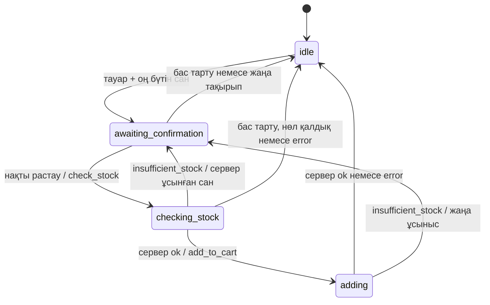

# ekt.kz — ЖИ сатушы-кеңесші қабаты

Бұл репозиторий команданың **3-адамының ғана** жұмысын қамтиды: NLU, диалог контексі, жауап құрастыру, аналог таңдау және себетке қосуды растау логикасы. Фронтенд, HTTP сервер, ekt.kz API, BasicAuth, себет базасы және деректерді сақтау іске асырылмайды.

## Іске қосу

Node.js 20 немесе жаңарақ нұсқасы қажет. Қосымша пакет орнатылмайды.

```sh
npm test
npm run demo
```

Демо деректері — тек жасанды тест фикстуралары, нақты дүкен ұсыныстары емес.

## Қысқа архитектуралық жоспар

1. `src/nlu.js`: қазақша/орысша ережелерге негізделген интенттер мен тауар ID/санын шығару. «10 дана керек» — сұрау, «иә, себетке қос» — растау.
2. `src/dialogue.js`: таза `reduce(state, event)` функциясы; кіріс күйін өзгертпей `{state, reply, requests}` қайтарады. Күйді сақтау мен оқиғаларды кезекпен жеткізу — 2-адамның міндеті.
3. Сол модуль сервер берген тауарлардан ғана карточка мен жауап құрайды, бірнеше тауар болса нақтылау сұрайды, аналогты нақты ортақ өрістер бойынша таңдайды.
4. `src/prompts.js`: провайдерге тәуелсіз қатаң жүйелік промт және `buildMessages(context)`. LLM клиенті мен желілік интеграция жоқ.
5. `contracts/dialogue.schema.json`: JSON Schema Draft 2020-12 кіріс/шығыс контракттары. `tests/dialogue.test.js`: диалог және қауіпсіз растау сценарийлері.

## Қолдану интерфейсі

```js
import { createSession, reduce } from './src/dialogue.js';
const state = createSession();
const next = reduce(state, { type: 'user', text: 'Кабель ізде' });
// next.state — сервер сессияға сақтайды
// next.reply — фронтендке беріледі
// next.requests — сервер орындайтын декларативті сұраныстар
```

Сессия әр клиентке бөлек. `products` — бұрын аталған тауарлар, `focusIds` — қазір талқыланатын тауар(лар), `pending` — растауға ұсынылған нақты тауар/сан, `clarification` — нақтылауды күткен интент, `request` — жалғыз белсенді сервер сұранысы. Шикі пайдаланушы мәтіні сессияда сақталмайды. Қойма қалдығының карточкадағы мәні растау шешіміне қолданылмайды.

## Себетке қосу state machine



`check_stock` — қажетті қосымша контракт: сервер нақты қалдықты қайта тексеріп, сұралған санға `ok`, `insufficient_stock` немесе `error` береді. ЖИ қоймаларды қоспайды, қалдықпен сұралған санды салыстырып қорытынды шығармайды. `available_qty` серверде есептеледі; модуль тек оның жарамды оң бүтін ұсыныс екенін тексереді. Нөл болса қосу ұсынылмайды.

Жаңа санға міндетті түрде қайта растау және қайта `check_stock` керек. `add_to_cart` орындалып жатқан кезде қайталама сұраныс жіберілмейді; осы кезеңдегі «жоқ» бұрын жіберілген әрекетті кері қайтара алмайды, сондықтан нәтиже күтіледі. Ескірген/қайталанған жауап `request_id`, `action`, ал себет әрекеттерінде қосымша `product_id`, `quantity` бойынша тексеріледі. Жаңа тақырып ескі ұсынысты жарамсыз етеді. «Қосылды» тек сәйкес `add_to_cart: ok` нәтижесінен кейін айтылады.

## Сервермен контракт — 2-адам

Кіріс: схема ішіндегі `$defs.serverEvent`. Мысалы іздеу нәтижесі:

```json
{
  "type": "server",
  "products": [{
    "id": 515291, "name": "Демо кабель", "category": "Кабель",
    "attributes": {"voltage": "220 В"}, "price": 1500,
    "currency": "KZT", "stock": 20, "certificate_url": null
  }],
  "action_result": {"request_id": "r1", "action": "search", "status": "ok"}
}
```

Қалдықты қайта тексеру жауабы:

```json
{
  "type": "server",
  "action_result": {
    "request_id": "r2", "action": "check_stock", "status": "insufficient_stock",
    "product_id": 515291, "quantity": 10, "available_qty": 6
  }
}
```

Шығыс: `$defs.request`. Жаңа сан расталып, қайта тексеру `ok` қайтарған соң ғана:

```json
{
  "request_id": "r4", "action": "add_to_cart",
  "product_id": 515291, "quantity": 6, "confirmed": true
}
```

| Action | Қосымша кіріс/шығыс өрістер |
|---|---|
| `search` | сұраныс: `query`; нәтиже: `products` |
| `get_product_info` | сұраныс: `product_id`, `field`; нәтиже: сұралған ID бар `products` |
| `get_alternatives` | сұраныс: `product_id`; нәтиже: сервер ұқсас деп тапқан `products` |
| `get_purchase_terms` | нәтиже: `purchase_terms.payment`, `delivery`, `minimum_order` |
| `check_stock` | сұраныс: `product_id`, `quantity`, `confirmed: true`; нәтиже: сол ID/сан және `status` |
| `add_to_cart` | сол өрістер; нәтиже: `ok`, `insufficient_stock` + `available_qty` немесе `error` |

Өріс жоқ немесе `null` болса, ол белгісіз. Сервер қоймалар дерегін өзі қалыпқа келтіреді; `stock` — тек көрсетілетін мән. Валюта берілмесе ЖИ оны болжамайды. `get_product_info` жауабы жаңартылған толық тауар снимогы ретінде қабылданады, ескі өрістермен толтырылмайды.

Сервер интеграциясының міндеттері (бұл жерде іске асырылмайды):

- Шекарада JSON Schema валидациясы, өнім ID бірегейлігі және дерек типтерін тексеру. Модуль барлық схема шектеулерінің толық runtime валидаторы емес.
- Сервер оқиғасын тек сенімді арнадан беру; браузерден келген мәтінді `type: server` ретінде өткізбеу. Клиент күйді немесе `confirmed` өрісін өздігінен бере алмайды.
- Бір сессия оқиғаларын кезекпен өңдеу; күй мен шығарылған әрекетті сенімді сақтау. `request_id` сессия ішінде бірегей; идемпотенттік кілт ретінде **session_id + request_id** қолдану. Қайталанған жеткізуден қосарланған себет операциясын сервер қорғайды.
- `add_to_cart` кезінде қалдықты атомарлы тексеру. Тексеру мен қосу арасындағы өзгерісте `insufficient_stock` қайтару. `error` немесе таймауттағы белгісіз нәтиже үшін сервер операцияны салыстырып анықтауы керек; ЖИ автоматты қайта қоспайды.
- Уақыт шектеуі/сессия мерзімі, сақтау, журналдардағы құпияларды тазалау — серверде. Мұнда таймер, сақтау немесе желілік retry жоқ.

## Фронтендпен контракт — 1-адам

Кіріс пайдаланушы оқиғасы: `{"type":"user","text":"одан 5 дана қос"}`. Шығыс: `$defs.reply`:

```json
{
  "message": "Қай тауар туралы айтып тұрсыз?",
  "cards": [{"id": 515291, "name": "Демо кабель", "price": 1500, "currency": "KZT"}],
  "handoff": false
}
```

`cards` сервер дерегін ғана қамтиды. `navigation: "cart"` — себетке өту сигналы; төлем рәсімдеу орындалмайды. `handoff: true` — менеджерге бағыттау ұсынысы, менеджерге нақты хабарлама жіберілмейді. Фронт мәтіндерді HTML ретінде орындамауы, URL-дерді тексеруі керек. Бұл модуль UI жасамайды.

## Промт және жауап стратегиясы

Өндірілетін жауаптар әдепкіде детерминдік: бар деректі ғана көрсетеді; жетіспейтін ақпарат үшін **«Қолда бар деректерде бұл көрсетілмеген»** дейді. Аналог рейтингі — бірдей санат, дәл сәйкес сипаттама өрістері, бір валютадағы төмен баға; тең болса сервер тізімінің реті сақталады. Бұл техникалық үйлесімділік кепілдігі емес. Ұқсастыққа дәлел жоқ болса, тек сервер оны балама деп қайтарғанын айтады.

`SYSTEM_PROMPT` сыртқы білімге, ойдан шығарылған фактілерге, дерек ішіндегі нұсқауларға және төлем құпияларын сұрауға тыйым салады. `buildMessages` тек қажет қалыпқа келтірілген контекстпен шақырылады. Промт өздігінен LLM қатесіздігіне кепіл емес: осы нұсқада тексерілмеген LLM мәтіні көрсетілмейді және LLM-ге әрекет орындау құқығы берілмейді. Кейін LLM қосылса, еркін жауапты фактілермен салыстырып тексеретін бөлек интеграциялық қабат керек.

NLU — шағын, кеңейтілетін ережелік MVP; еркін тілдің барлық нұсқаларын танымайды. Белгісіз сұрақ fallback береді. Артикул әзірге `id`-мен бірдей сандық идентификатор ретінде келісілген. Қосу саны тек бүтін дана; метр, бөлшек сан және тауар топтамасын бірден қосу қолдау таппайды. Нақты растаулардың ақ тізімі `recognize` ішінде: «иә», «растаймын», «да», «подтверждаю» және көрсетілген нақты тіркестер. Құрамдас/екіұшты «иә, бірақ…» автоматты растау емес.

Төлем деректері сұралмайды/сақталмайды; айқын карта нөмірі/CVV/пароль мәтіні өңдеуге жіберілмейді. Бұл шағын сүзгі барлық жеке деректі танитын DLP жүйесі емес. BasicAuth логині/паролі модульге берілмейді.

## Тест диалогтары

| № | Диалог/оқиға | Күтілетін нәтиже |
|---|---|---|
| 1 | «Кабель ізде» → сервер тауарлары | `search`, нақты карточкалар |
| 2 | «маған 10 дана керек» | тек ұсыныс, себетке әрекет жоқ |
| 3 | «иә, себетке қос» → `check_stock: ok` | содан кейін ғана `add_to_cart` |
| 4 | 10 дана → сервер 6 дана ұсынады | 6 данаға қайта растау және қайта тексеру |
| 5 | бір тауар → «одан 5 дана қос» | сол тауармен ұсыныс |
| 6 | екі тауар → «одан 5 дана қос» → «артикул 515292» | нақтылау, 5 дана сақталады |
| 7 | «сертификат бар ма» → `null` | белгісіз ақпарат туралы нақты жауап |
| 8 | «қуаты қандай» → `power` жоқ | ойдан қосылмайды |
| 9 | «балама бар ма» → ұқсас тауарлар | тек тізімнен таңдау, нақты себеп |
| 10 | «жеткізу шарттары» → шарттар жоқ | белгісіз ақпарат туралы жауап |
| 11 | «жобаны толық есептеп бер» | fallback, менеджерге бағыттау ұсынысы |
| 12 | «себетке өт» | `navigation: cart` |
| 13 | тексеру кезінде «жоқ» → кешіккен `ok` | қосу шықпайды |
| 14 | қате ID/сан немесе қайталанған нәтиже | нәтиже еленбейді, қосарланған әрекет жоқ |
| 15 | қосу кезінде қалдық өзгерді | жаңа санға қайта растау |
| 16 | нөл қалдық / жарамсыз сан / төлем құпиясы | қосу шықпайды, құпия сақталмайды |

Барлық орындалатын тесттер `node:test` стандартты кітапханасын қолданады.
