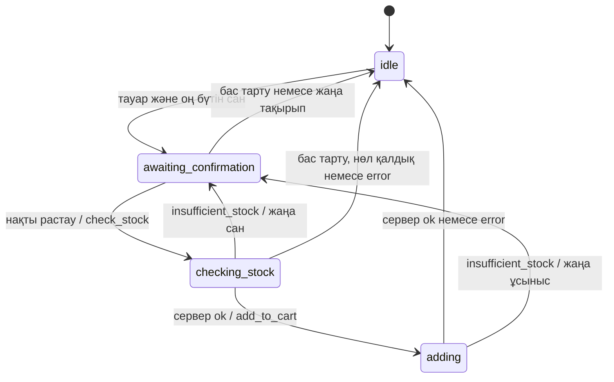

# hack-010f81b0-black-time
Hackathon team repository for Black Time
Black Time — ekt.kz ЖИ сатушы-кеңесші
Репозиторий: hack-010f81b0-black-time
Команда: Black Time, 3 қатысушы
Кейс: ekt.kz сайтындағы чатқа арналған ЖИ-ассистент
Сипаттамалардағы есеп күні: 2026-09-23
Ағымдағы күй: backend, ЖИ/диалог модулі және frontend прототипі бөлек әзірленген. Бұл README үш бөліктің құжаттамасын біріктіреді. Олардың бір жүйе ретінде толық жұмыс істеуі және нақты ekt.kz-пен толық интеграциясы әлі расталмаған.
Төмендегі іске асырылған мүмкіндіктер мен тексеру нәтижелері команда ұсынған сипаттамаларға негізделген. README біріктірілген кезде код пен тесттер қайта орындалған жоқ. Демо деректер нақты дүкен ұсыныстары емес.

1. Жоба мақсаты
ekt.kz клиентіне тауарды таңдауға көмектесетін онлайн сатушы-кеңесші әзірлеу. Ассистент каталогтағы ақпаратқа сүйеніп, техникалық сипаттамалар, сертификаттар, тауардың бар-жоғы, аналогтар және сатып алу шарттары туралы жауап беруі керек.
Негізгі пайдаланушы жолы:
Клиент чатты ашады
  → тауар немесе сатып алу шарттары туралы сұрайды
  → каталогқа негізделген жауап алады
  → тауар мен санын таңдайды
  → қосуды нақты растайды
  → сервер қалдықты тексереді және себетті жаңартады
  → клиент себетке / тапсырысты рәсімдеуге өту сілтемесін алады
Бұл — жобаның мақсатты сценарийі. Қазіргі нұсқада оның бөліктері жеке модульдерде және демода бар; толық тізбек әлі біріктірілмеген.
2. Команда жұмысының бөлінуі және ағымдағы мәртебе
Бөлік	Жауапкершілік	Берілген сипаттама бойынша бар	Әлі жоқ немесе расталмаған
Backend	FastAPI сервері, каталог API-імен байланыс, BasicAuth, параметрлер мен қателерді өңдеу	/health, каталогтың бір бетін алу, тауарды ID арқылы алу, CORS, mock тесттер	Нақты API тексеруі, іздеу, деректерді ЖИ контрактына бейімдеу, чат/сессия өңдеуі, нақты себет
ЖИ / диалог	Сұранысты түсіну, контекст, жауап, аналог, растау логикасы	Қазақша/орысша ережелік NLU, reduce, v2 контракт, қауіпсіз растау күй машинасы, промт, тест сценарийлері	LLM клиенті, HTTP сервер, желілік интеграция, күйді сақтау, нақты себет операциялары
Frontend	Чат интерфейсі, карточкалар, растау, себет көрінісі	Бір index.html ішіндегі қазақша интерактивті демо, жергілікті себет, бейімделетін интерфейс	Backend пен ЖИ-ге қосылу, нақты каталог, файл мазмұнын оқу, нақты тапсырыс

Маңызды: frontend-тегі replyTo() және ЖИ модуліндегі NLU — екі бөлек ережелік механизм. Frontend қазір ЖИ модулін де, backend API-ін де пайдаланбайды.
3. Міндетті талаптарға сәйкестік
Талап	Қазіргі ішінара іске асыру	Толық орындау үшін қажет
M1. Каталогтан тауар ақпараты, бар-жоғы, сипаттамалар және сертификат беру	Backend деректі ID бойынша сұратады; ЖИ сервер берген карточкаларды өңдейді; frontend демо көрсетеді	Нақты JSON құрылымын тексеру, артикул/атау бойынша іздеу, схемаға бейімдеу және үш бөлікті қосу
M2. Жоқ тауарға негізделген аналог ұсыну	ЖИ сервер кандидаттарын салыстырады және жоқ тауарға балама сұрайды; frontend-те демо сценарий бар	Нақты кандидаттарды табу және каталогпен интеграциялық тексеру
M3. Төлем, жеткізу және ең аз партия шарттарын түсіндіру	ЖИ берілген шарттарды ғана көрсетеді; frontend шарттары ойдан алынған	Расталған шарттар дереккөзі және серверлік өңдеу
M4. Тек нақты растаудан кейін, қалдықты ескеріп қосу	ЖИ check_stock → add_to_cart тізбегін құрады; frontend-те жергілікті демо растауы бар	Нақты серверлік себет, сессиялар, қайталама әрекеттен қорғау және қосу кезіндегі атомарлы қалдық тексеруі
M5. Жаңартылған себетке / рәсімдеуге сілтеме беру	ЖИ navigation: "cart" және сервер берген сілтемелерді қайтара алады; frontend демо себетті ашады	Нақты себет интеграциясы және оның өзекті күйіне апаратын сілтеме

Жеке модульдегі сценарий немесе mock тест толық жүйенің сол талапты орындағанын білдірмейді.
4. Архитектура
Қазіргі бөлек компоненттер
Backend:
браузер / API клиенті → FastAPI → ekt.kz каталог API-і → JSON

ЖИ / диалог:
пайдаланушы немесе сервер оқиғасы → reduce(state, event)
                               → {state, reply, requests}

Frontend демо:
index.html → replyTo() → жасанды PRODUCTS → JavaScript жадындағы себет
Жоспарланған интеграция
Frontend чат
    ↕ пайдаланушы мәтіні, жауап, карточкалар
Backend-тегі чат және сессия өңдегіші [әлі қосылмаған]
    ↕ оқиғалар / {state, reply, requests}
ЖИ / диалог модулі
    ↓ орындалуға ұсынылған requests
Backend адаптерлері [толық іске асырылмаған]
    ├─ каталогты іздеу және мәлімет алу → ekt.kz API
    ├─ сатып алу шарттары → расталған дереккөз
    └─ қалдықты тексеру және қосу → себет интеграциясы
FastAPI — Python, ал диалог модулі — JavaScript. Оларды байланыстыратын орындау арнасы берілген нұсқаларда іске асырылмаған. ЖИ-дің requests нәтижесі HTTP сұранысын өзі орындамайды: оны сервер өңдеуі керек.
5. Негізгі файлдар
Төменде бастапқы сипаттамалардағы атаулар сақталған. ЖИ файлдарының жолдары оның өз модулінің түбіріне қатысты. ЖИ модулі мен index.html файлының ортақ репозиторийдегі нақты орналасуы берілмеген; іске қосқанда тиісті компоненттің қалтасын пайдаланыңыз.
Бөлік	Файл	Мақсаты
Backend	backend/main.py	FastAPI, маршруттар, параметрлерді тексеру, CORS
Backend	backend/ekt_client.py	Requests, BasicAuth, таймауттар, сыртқы қателер
Backend	tests/test_api.py	Нақты желіге шықпайтын mock тесттер
Backend	requirements.txt	Python тәуелділіктері
Backend	.env.example	Құпиясыз баптау үлгісі
Backend	.env	Жергілікті кіру деректері; Git-ке қосылмайды
Backend	.gitignore	Құпиялар, виртуалды орта және уақытша файлдар
ЖИ	src/nlu.js	Интент, артикул, ID және санды шығару
ЖИ	src/dialogue.js	Сессия, диалог, жауап, растау және әрекет сұраныстары
ЖИ	src/prompts.js	SYSTEM_PROMPT, buildMessages(context)
ЖИ	src/i18n.js	Қазақша/орысша жауап шаблондары
ЖИ	contracts/dialogue.schema.json	JSON Schema Draft 2020-12, ұсынылған v2 контракт
ЖИ	tests/dialogue.test.js	Диалог пен қауіпсіздік сценарийлері
ЖИ	tests/must-have.test.js	M1–M5 жеке сценарийлері
Frontend	index.html	HTML, CSS, JavaScript және SVG иллюстрациялар

6. Backend: дайындау және іске қосу
Қажетті орта
Python 3.10 немесе жаңарақ нұсқасы және Windows Python Launcher (py) қажет. PowerShell терминалын backend сипаттамасындағы репозиторий түбірінде, яғни requirements.txt және .env.example орналасқан қалтада ашыңыз.
py -3 --version
py -3 -m venv .venv
.\.venv\Scripts\python.exe -m pip install -r requirements.txt
FastAPI, Uvicorn, Requests, python-dotenv, pytest және httpx орнатылады. Виртуалды ортаны бөлек белсендіру қажет емес: командалар .venv ішіндегі Python-ды тікелей пайдаланады.
Кіру деректері
.env файлын тек ол жоқ болса жасаңыз:
if (-not (Test-Path -LiteralPath .env)) {
    Copy-Item -LiteralPath .env.example -Destination .env
}
Үлгі:
EKT_LOGIN=apiuser
EKT_PASSWORD=""
Нақты құпиясөзді жергілікті .env файлына ғана енгізіңіз. Бар .env файлын үстінен жазбаңыз. Оны Git-ке, README-ге, тесттерге, чатқа немесе frontend-ке көшірмеңіз.
Сервер .env файлын репозиторий түбірінен оқиды. Операциялық ортада берілген айнымалылар басым; .env оларды алмастырмайды. Баптау өзгергеннен кейін серверді қайта іске қосыңыз.
Серверді іске қосу
.\.venv\Scripts\python.exe -m uvicorn main:app --app-dir backend --reload --host 127.0.0.1 --port 8000
Терминал ашық тұруы керек. Тоқтату: Ctrl+C. Бұл іске қосу тек жергілікті компьютерге арналған.
Тексеру мекенжайлары
http://127.0.0.1:8000/health
http://127.0.0.1:8000/docs
http://127.0.0.1:8000/products?page=1
http://127.0.0.1:8000/products?page=2
http://127.0.0.1:8000/products/515291
/docs бетінде маршрутты ашып, Try it out → Execute арқылы тексеріңіз.
/health жауабы:
{"status":"ok"}
Бұл маршрут сыртқы API-ге шықпайды және кіру деректерін қажет етпейді. Оның сәтті жауабы ekt.kz интеграциясының жұмыс істейтінін растамайды.
Каталог маршруттары
Біздің маршрут	Сыртқы API
GET /health	Сыртқы сұраныс жоқ
GET /products?page=1	GET https://ekt.kz/api/products?page=1
GET /products/515291	GET https://ekt.kz/api/products/detail?id=515291

page әдепкіде 1. page және product_id оң бүтін сан болуы керек. Бір сұраныс каталогтың тек бір бетін алады. Тауардың ID нөмірі мен артикулы бір ұғым емес: /products/{product_id} артикул бойынша іздемейді.
Сәтті жауаптың келісімі төмендегіше. data орнындағы белгі — нақты JSON үлгісі емес, сыртқы жауаптың орнын көрсетеді:
{
  "source": "ekt.kz",
  "data": <сыртқы API қайтарған JSON>
}
data сыртқы JSON құрылымын сақтайды. Оның объект, тізім немесе басқа мән екені, сондай-ақ name, price, stock өрістерінің болуы расталмаған. Жоқ мәндер нөлге айналдырылмайды. Бұл жауап ЖИ модулінің қалыпқа келтірілген v2 контрактына әлі бейімделмеген.
CORS және frontend-пен қосылу шекарасы
Рұқсат етілген origin-дер:
http://localhost:5500
http://127.0.0.1:5500
http://localhost:5173
http://127.0.0.1:5173
Барлық origin-ге * рұқсаты берілмейді. Интеграция кезінде frontend-ті келісілген origin-нен іске қосу керек. Қазіргі index.html файлын жай ашу — серверсіз демо режимі, ол backend-пен байланысты білдірмейді.
Қателер
Қате ақпараты JSON жауабының detail өрісінде беріледі. Параметр қатесінде ол қателер тізімі, сыртқы API қатесінде түсінікті хабарлама болады.
HTTP	Мағынасы және әрекет
422	Жарамсыз page немесе product_id; оң бүтін сан жіберіңіз
503	EKT_LOGIN немесе EKT_PASSWORD бапталмаған; тексеріп, серверді қайта қосыңыз
504	Қосылу немесе оқу таймауты; желілік қолжетімділікті тексеріңіз
502	Қосылу қатесі, JSON емес жауап, redirect немесе сыртқы HTTP қатесі; сыртқы 401/403 болса кіру деректерін тексеріңіз

Сыртқы HTTP қатесі автоматты түрде «тауар жоқ» дегенді білдірмейді. Қате жауапқа құпиясөз, Authorization, traceback немесе сыртқы сервердің толық HTML қатесі шығарылмайды.
Requests синхронды орындалады. Қосылу таймауты — 5 секунд, оқу таймауты — 15 секунд. HTTPS сертификаты тексеріледі, redirect автоматты орындалмайды. Клиент еркін сыртқы URL бере алмайды. Автоматты қайталау және іске қосылғанда толық каталогты жүктеу жоқ.
7. ЖИ / диалог модулі
Іске қосу
Модуль сипаттамасы бойынша Node.js 20 немесе жаңарақ нұсқасы қажет. Қосымша пакет орнатылмайды. Модульдің npm скрипттері орналасқан қалтасында орындаңыз:
npm test
npm run demo
Демо жасанды тест фикстураларын пайдаланады. Бұл командалар FastAPI серверін немесе браузерлік чат интеграциясын іске қоспайды.
Жұмыс принципі
NLU — қазақша/орысша ережелерге негізделген бастапқы нұсқа. Жауаптар әдепкіде детерминдік шаблондармен жасалады. SYSTEM_PROMPT және buildMessages бар, бірақ LLM клиенті мен желілік қосылым жоқ.
import { createSession, reduce } from './src/dialogue.js';

const state = createSession();
const next = reduce(state, { type: 'user', text: 'Кабель ізде' });

// next.state    — сервер сессияға сақтауы керек
// next.reply    — frontend-ке берілетін жауап
// next.requests — сервер орындайтын декларативті сұраныстар
reduce(state, event) кіріс күйін өзгертпейді. Әр клиентке жеке сессия қажет. Күйді сақтау және оқиғаларды кезекпен жеткізу осы модульде іске асырылмаған.
Сессияда бұрын аталған products, талқыланатын focusIds, растауды күтетін pending, нақтылау күйі clarification және бір белсенді request бар. Толық чат тарихы сақталмайды; белсенді іздеу мәтіні уақытша request.query ішінде болады. Жаңа күй нұсқасы — version: 2; ескі сессиядан көшкенде жаңа сессия бастау қарастырылған.
createSession('kk' | 'ru') тіл орнатады. Пайдаланушы оқиғасындағы locale басым; ол болмаса негізгі сөздермен тіл анықталады, екіұшты қысқа мәтінде бұрынғы тіл сақталады. Сервер жауабы сессия тілін өзгертпейді. Каталог фактілері аударылмайды және толықтырылмайды.
Серверге берілетін әрекеттер
Төмендегілер — ЖИ контрактының action атаулары, қазіргі FastAPI серверінің дайын HTTP маршруттары емес.
Action	Сұраныс / күтілетін нәтиже
search	query → products
get_product_info	product_id, field → сұралған ID бар жаңартылған products
get_alternatives	product_id немесе бастапқы query → сервер ұсынған кандидаттар
get_purchase_terms	terms → purchase_terms.payment, delivery, minimum_order
check_stock	product_id, quantity, confirmed: true → сол ID/сан және мәртебе
add_to_cart	Сол өрістер → ok, insufficient_stock + available_qty немесе error

Ұсынылған v2 тауар контракты id, sku, name, category, description, attributes, price, currency, stock, availability, warehouse_stocks, certificate_url өрістеріне орын береді. Бұл ekt.kz-тің нақты JSON схемасы екені расталмаған.
Жоқ немесе null өріс — белгісіз ақпарат. Валюта болжанбайды. sku — бастапқы нөлдері сақталатын жол, id — сандық идентификатор. Ескі мысалдар үшін сандық артикулға дәл sku табылмаса ID ретінде іздеу қарастырылған; бұл нақты каталогпен тексерілген сәйкестік емес.
Қойма қалдықтары бөлек сақталады. stock, availability және қосуға болатын available_qty мәндерінің дұрыстығына сервер жауап береді; ЖИ қоймаларды қосып есептемейді. get_product_info нәтижесі толық жаңартылған снимок ретінде қабылданады, жоқ өрістер ескі мәндермен толтырылмайды. Бірнеше тауар табылса нақтылау сұралады.
Себетке қосуды растау

«10 дана керек» — ұсынысқа негіз, бірақ қосуды растау емес. Нақты растаудан кейін ғана check_stock шығады. Сервер 10 орнына 6 дана ұсынса, жаңа санға қайта растау және қайта тексеру қажет. Нөл қалдықта қосу ұсынылмайды, балама сұралады.
«Қосылды» тек сәйкес add_to_cart: ok нәтижесінен кейін айтылады. Ескірген және қайталанған жауаптар request_id, action, ал себет үшін қосымша product_id, quantity арқылы тексеріледі. Жаңа тақырып ескі ұсынысты жарамсыз етеді. Жіберіліп қойған қосу әрекетін кейінгі «жоқ» автоматты кері қайтара алмайды; модуль нәтижені күтеді.
Сервер интеграциясында JSON Schema валидациясы, сенімді сервер оқиғалары, әр сессияны кезекпен өңдеу, күйді сақтау, session_id + request_id арқылы идемпотенттік және қосу кезіндегі атомарлы қалдық тексеруі қажет. Таймаутта нәтижесі белгісіз әрекетті сервер анықтауы керек; ЖИ оны автоматты қайта жібермейді. Бұл кепілдіктер қазіргі каталог backend-інде іске асырылды деп есептелмейді.
Frontend-ке жауап
Пайдаланушы оқиғасының үлгісі:
{"type":"user","text":"одан 5 дана қос","locale":"kk"}
reply ішінде message, locale, cards, handoff болады. Карточкалар сервер берген деректермен ғана құралады. Сәтті қосудан кейін navigation: "cart" беріледі. Сервер cart_url / checkout_url HTTPS сілтемелерін берсе, олар reply.links арқылы қайтарылады. Сілтеме жоқ болса URL ойдан жасалмайды.
navigation — өту батырмасын көрсетуге арналған белгі, автоматты төлем емес. handoff: true менеджерге бағыттау ұсынысын білдіреді, бірақ менеджерге нақты хабарлама жібермейді. Frontend жауап мәтінін HTML ретінде орындамауы және сілтемелердің қауіпсіздігін тексеруі керек.
Жауаптар мен аналогтар
Ақпарат жоқ болса: «Қолда бар деректерде бұл көрсетілмеген» немесе орысша баламасы беріледі. Сатып алу шарттарынан тек сұралған өрістер көрсетіледі; белгісіз шарт басқа белгілі шартпен алмастырылмайды.
Бос іздеуде бастапқы сұрау бойынша балама сұралады. Жалғыз тауар жоқ болса немесе қайта тексеруде қалдық нөл болса, тауар ID-і бойынша балама сұралады. Бірнеше тауарда алдымен нақтылау қажет.
Аналогты таңдау сервер кандидаттарының ортақ санаты, дәл сәйкес сипаттама өрістері және бір валютадағы бағасы бойынша жасалады. Тең жағдайда сервер реті сақталады. Белгісіз қолжетімділік «бар» деп көрсетілмейді. Бұл инженерлік үйлесімділік кепілдігі емес. Кандидат жоқ болса тауар ойдан шығарылмайды, менеджерге бағыттау ұсынылады.
NLU барлық еркін сөйлемді танымайды. Белгісіз сұрақ fallback береді. Қосу саны тек бүтін дана; метр, бөлшек сан және тауар топтамасын бірден қосу қолдау таппайды. «Иә, бірақ…» сияқты екіұшты мәтін нақты растау емес.
8. Frontend: интерактивті демо
Іске қосу
index.html файлын Chrome, Edge, Firefox немесе Safari браузерінде ашыңыз. Қазіргі демоға орнату, build, API кілті, сервер және интернет қажет емес.
HTML, CSS және JavaScript бір файлда. Сыртқы кітапханалар, қаріптер және суреттер жүктелмейді. Иллюстрациялар файл ішіндегі SVG; олар өндірушілердің нақты фотолары емес.
Демо сценарийлер
Әрекет	Демодағы нәтиже
Бастапқы диалог	IEK C16 карточкасы; санды − / + немесе өріспен өзгерту
«Себетке қосу»	Растау сұралады, осы сәтте себет өзгермейді
«Иә, қосу»	Батырмамен немесе дәл осы мәтінмен расталғанда демо себетке қосылады
«Жоқ, өзгерту»	Сан таңдауға қайтарады
«10 дана керек»	Әдепкі тауарда 10 × 1 500 ₸ = 15 000 ₸ растауы; басқа тауар таңдалса соңғы көрсетілгеніне қатысты
Оң жақтағы «Себетке қосу» сценарийі	Әрдайым IEK моделін пайдаланады
«Аналог табу»	Жоқ ABB және Schneider баламасы; ортақ сипаттамалар мен ажырату қабілетінің айырмашылығы
«Жеткізу туралы»	Ойдан алынған төлем/жеткізу шарттары
Скрепка арқылы файл таңдау	Тек атауы, түрі және көлемі көрсетіледі; 10 МБ шегі
«Себет»	Ағымдағы жергілікті тізім, сан және жалпы сома
«Тапсырысты рәсімдеу»	Тек демо түсіндірмесі; нақты тапсырыс жасалмайды

Мәтіндік мысалдар: кабель, Schneider Easy9, IEK 10 дана керек, ABB C16 бар ма?, жеткізу шарттары, сертификат.
Барлық көрсетілген тауар, баға, қалдық және сатып алу шарттары жасанды. Оларды нақты ekt.kz деректері ретінде қолдануға болмайды.
Ішкі құрылымы мен шектеулері
PRODUCTS — төрт демо тауар. state — бет ашық тұрған кездегі себет, карточкалар және күтілетін растау. replyTo() кілт сөздерге қарап дайын жауап таңдайды, ЖИ моделіне сұраныс жібермейді.
askConfirmation() және confirm() екі қадамды қосуды орындайды. Қайта басу бір ұсынысты екі рет қоспайды; себеттегі санмен бірге жалпы сан демо қалдықтан аспайды. renderCart() соманы, белгілерді және қолжетімді санды жаңартады. Бұл жергілікті қорғаныс нақты серверлік себеттің кепілдігін алмастырмайды.
Себет пен чат тек JavaScript жадында. Бетті жаңарту бастапқы күйге қайтарады. Чаттағы қайта бастау батырмасы диалогты жаңартады, бірақ себетті сақтайды. Себет белгісі тауарлардың жалпы санын көрсетеді; кабель демода метрмен есептеледі.
CSS кең экран, планшет және 700 px-ге дейінгі мобильді көріністі қолдайды. Сипаттамада lang, батырма белгілері, пернетақтамен басқару, модаль фокусы, Escape арқылы жабу және қозғалысты азайту баптауы қарастырылған.
9. Тіркемелер және деректер шекарасы
Қабат	Қазіргі қолдау	Әлі орындалмайды
Frontend	PDF, Excel, Word, JPEG, PNG таңдау; атауы/түрі/көлемі; 10 МБ шегі	Жүктеу, мазмұнын оқу немесе серверге жіберу
ЖИ	Excel (xls, xlsx), Word (doc, docx), PDF, JPEG метадерек контракты; requires_extraction жауабы	Файлды оқу, OCR, сақтау; басқа түрге unsupported
Backend	Каталог маршруттары	Файл қабылдау және мәтін шығару адаптері

Келісуді қажет ететін айырмашылық: frontend PNG таңдауға мүмкіндік береді, ал ЖИ модулінің сипатталған қолдауында PNG жоқ. Frontend-тегі метрлік кабель мен ЖИ-дегі бүтін данаға арналған сан контракты да әлі сәйкестендірілмеген.
Жоспарланған файл ағыны: frontend файлды серверге береді → сервер формат пен көлемді тексеріп, мәтінді шығарады → пайдаланушы тауар сұрауын нақтылайды → диалог модулі мәтіндік оқиғаны өңдейді. Бұл ағын қазір іске асырылмаған.
Файл мәтіні автоматты растауға айналдырылмайды. ЖИ оқиғасына файл байттары емес, серверлік идентификатор және метадерек беріледі. Тіркеме ескі растау ұсынысын тоқтатады; жіберіліп қойған қосу әрекеті болса оның нәтижесі күтіледі.
10. Тесттер және тіркелген нәтижелер
Backend
Репозиторий түбірінен:
.\.venv\Scripts\python.exe -m pytest -q
Mock тесттер /health, каталог параметрлері, ID, жауап келісімі, жарамсыз кіріс, баптау жоқтығы, таймаут, сыртқы HTTP қателері және JSON емес жауаптарды қамтиды. Нақты желі мен құпиясөз қажет емес.
Backend сипаттамасында 2026-09-23 үшін тіркелген есеп:
Тексеру	Хабарланған нәтиже
Python ортасы	Python 3.14.0
Mock тесттер	87 тест өтті
pip check	Тәуелділік қайшылығы табылмаған
Ескерту	Starlette тест клиентінің httpx қолдауына қатысты бір deprecation ескертуі
Uvicorn, --reload	Берілген іске қосу командасы тексерілген
/health, /docs	200
Кіру деректері жоқ /products?page=1	503
Нақты ekt.kz API	Тексерілмеген: ортада кіру деректері мен жергілікті .env болмаған

Бұл нәтижелер бастапқы backend есебінен алынған. README құрастырғанда қайта тексерілген жоқ. Уақытша тест сервері бастапқы есеп бойынша тоқтатылған.
ЖИ / диалог
npm test
npm run demo
Орындалатын тесттер node:test стандартты кітапханасын пайдаланады. Бастапқы 18 регрессиялық тестке қосымша Must have және басқа жаңа сценарийлер сипатталған:
Бөлім	Құжатта көрсетілген жеке тест саны / қамту
M1	6: карточка, ақпарат, сертификат, жоқ дерек, қоймалар және бастапқы сұрақ өрісі
M2	5: жоқ тауар, бос іздеу, сервер кандидаты, нөл қалдық, контекст
M3	2: шарттар толық және сұралған шарт жоқ
M4	1 және бастапқы бірнеше тест: қайта растау, қайталану, бас тарту, қалдық өзгерісі
M5	3: сервер сілтемесі, URL жоқ және сәтсіз/ескірген нәтиже
Қосымша	SKU контексі, қазақша/орысша тіл, тіркемелер шекарасы және контракт өрістері

Соңғы нұсқаның жалпы орындалған/өткен тест саны берілмеген; оны есептеп немесе болжап көрсетпейміз. Контракт өрістерінің тесті толық JSON Schema runtime валидациясын алмастырмайды. Нақты API, файл мазмұнын өңдеу және frontend маршруты бұл модульдің тесттеріне кірмейді.
Frontend және толық жүйе
Frontend үшін демо ағындары сипатталған, бірақ автоматты тест нәтижесі берілмеген. Нақты каталогпен, ЖИ-мен және серверлік себетпен end-to-end тест нәтижесі жоқ.
11. Қауіпсіздік қағидалары
BasicAuth деректері тек backend-те сақталады; ЖИ модуліне және браузерге берілмейді. .env, Authorization, құпиясөздер және кілттер жарияланбайды.
Растауға дейін себетті өзгертуге, баға/қалдық/сертификат/шарттарды ойдан шығаруға, төлем деректерін сұрауға немесе сақтауға болмайды. ЖИ модулінде айқын карта нөмірі, CVV және пароль мәтініне шағын сүзгі сипатталған; бұл барлық жеке деректі анықтайтын толық DLP жүйесі емес.
ЖИ промты дерек ішіндегі нұсқауларды орындауға және сыртқы біліммен каталог фактілерін толықтыруға тыйым салады. Промт өздігінен LLM қатесіздігіне кепіл емес. Қазіргі нұсқада LLM әрекет орындамайды; кейін қосылса фактілерді тексеретін бөлек интеграциялық қабат қажет.
Браузер type: server, сенімді күй немесе confirmed мәнін өзі белгілей алмауы керек. Серверлік валидация, сессиялар, атомарлы қосу, қайталанудан қорғау және сессия мерзімі — интеграция кезінде орындалатын міндеттер, дайын кепілдік емес. Қазіргі backend іске қосу нұсқаулығы жергілікті ортаға арналған.
12. Келесі интеграция кезеңі
Кезек	Жұмыс	Аяқталғанын көрсететін нәтиже
1	Жергілікті кіру деректерімен каталогтың бір бетін және ID 515291 сұрату	Нақты жауап құрылымы тіркелген, құпиялар жарияланбаған
2	Сыртқы JSON-ды ЖИ v2 контрактына сәйкестендіру; ID, SKU, валюта, қойма және өлшем бірліктерін келісу	Нақты үлгіге негізделген адаптер және валидация тесттері
3	Python backend пен JavaScript диалогын байланыстыру, сессия және оқиға өңдеуін қосу	user → reduce → request → server event → reply жолы жұмыс істейді
4	Frontend демо жауаптарының орнына сервер жауабын пайдалану	Чатта нақты дерек көрсетіледі, жүктелу және қате күйлері өңделеді
5	Іздеу, аналог және расталған сатып алу шарттарын қосу	M1–M3 нақты немесе анық белгіленген келісілген тест деректерімен тексеріледі
6	Себет интеграциясының тәсілін ұйымдастырушылармен нақтылау және іске асыру	Растау, қалдық, қайталанудан қорғау және өзекті себет сілтемесі тексеріледі
7	Файл форматтары мен өлшем бірлігі айырмашылықтарын шешу	PNG және метр/бөлшек сан бойынша бірдей контракт
8	Толық сценарийлерді орындау	M1–M5 нәтижелері нақты журналда тіркелген

Бұл кесте — келесі жұмыстың жоспары. Ондағы тармақтар орындалды деп есептелмейді. Берілген API мекенжайларында нақты себетке қосу операциясы көрсетілмеген; тестілік себет қолданылса, оның мәртебесі ашық белгіленуі керек.
13. Сағат сайынғы жұмыс журналы
Хакатондағы командалық есеп үшін әр сағаттағы нақты өзгерістерді осы бөлімге қосыңыз. Алдыңғы жазбаларды өшірмеңіз. Дайын жұмыс, тексерілген нәтиже, кедергі және келесі жоспарды бөлек жазыңыз. Сағат пен commit мәнін тек нақты белгілі болса енгізіңіз.
2026-09-23 — бастапқы біріктірілген есеп
Есеп сағаты: бастапқы материалдарда көрсетілмеген.
Осы құжаттағы жұмыс: backend, ЖИ/диалог және frontend сипаттамалары ортақ README-ге біріктірілді; интеграция шекаралары мен келесі жұмыстар белгіленді. Кодтың біріктірілгені туралы жаңа нәтиже жоқ.
Бөлік	Сипатталған жұмыс	Тексеру / кедергі
Backend	Каталог маршруттары, BasicAuth баптауы, таймаут, қате өңдеу, CORS	Бастапқы есепте 87 mock тест өткен; нақты API тексерілмеген
ЖИ / диалог	NLU, контекст, жауап, аналог, растау күй машинасы, v2 контракт	Тест сценарийлері бар; соңғы жалпы өткен саны берілмеген; LLM/HTTP жоқ
Frontend	Чат, карточкалар, растау, жергілікті себет, тіркеме метадеректері	Жасанды деректермен жеке демо; backend пен ЖИ қосылмаған
Ортақ интеграция	Қазіргі байланыстар мен жетіспейтін адаптерлер құжатталды	Толық жүйе тесті жоқ; JSON, өлшем бірлігі, PNG және себет мәселелері ашық

Келесі басымдық: нақты API жауабын тексеріп, backend деректерін ЖИ контрактына сәйкестендіру.
Commit: көрсетілмеген.
Келесі сағатқа арналған көшірілетін үлгі
Төмендегі үлгіні нақты орындалған жұмыспен толтырып, жаңа жазба ретінде қосыңыз. Бұл үлгі аяқталған жұмыс есебі емес.
### YYYY-MM-DD HH:MM — сағаттық жаңарту

| Бөлік | Осы сағатта нақты орындалған жұмыс | Тексеру нәтижесі |
| --- | --- | --- |
| Backend | ... | Команда/сценарий және нақты нәтиже немесе «тексерілмеді» |
| ЖИ / диалог | ... | Команда/сценарий және нақты нәтиже немесе «тексерілмеді» |
| Frontend | ... | Қолмен/автоматты тексеру және нақты нәтиже |
| Интеграция | ... | Қай бөліктер бірге тексерілді, қайсысы әлі бөлек |

**Кедергі:** ...
**Келесі сағаттың мақсаты:** ...
**Commit:** нақты hash немесе «әлі жасалмаған».
14. Құжаттың дерек негізі
README команда берген backend сипаттамасы, ЖИ/диалог модулінің сипаттамасы, frontend прототипінің сипаттамасы және кейс талаптары негізінде жасалды. Үш компоненттің мүмкіндіктері олардың сипатталған шекарасында берілген. Жоспарланған интеграциялар дайын функциялар ретінде көрсетілмейді.
